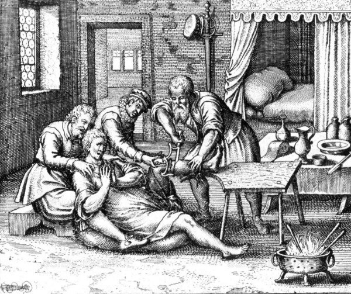

_Black bile, yellow bile, phlegm, and blood were four fluids that made up the body’s dataset. Physicians looked for fluctuations in these features to understand the bodies inner workings and the patient’s personality. Disease was a byproduct of imbalance of data._

In 1685, King Charles II suffered a stroke. His royal physicians immediately set to work to save his life. 

**They drained him of 2 cups of blood, performed enemas , and rubbed ointments of pigeon dung and powdered pearls. They shaved his skull and pressed burning hot irons into him.** He really got the full treatment. Charles fell into convulsions four days later and died. (source: The Clockwork Universe)

> In the 17th century, a peasant who couldn’t afford a doctor had a better chance of survival.

Were these doctors sinister or incompetent? It is easy to dismiss them as quacks, but let’s explore a different theory: **They were data scientists.**

---

### AI is the New Alchemy 

In December 2007, [Ali Rahimi](https://www.youtube.com/watch?v=Qi1Yry33TQE) claimed that machine learning was mimicking alchemy and implored the data science community to be more rigorous. Alchemy wasn’t all bad, Ali said, it led to modern disciplines like chemistry and metallurgy. But alchemy is also associated with quackery and snake oil.

#### This is a slightly different point. 

1685 was in the middle of the scientific revolution, a time when Kepler and Galileo redefined the universe, the telescope and microscope redefined the world, we discovered the cell, the atom, and the speed of light. We even had peer-reviewed white papers!

Today’s white papers contain strange symbols intermingled with stranger technical jargon. There’s an endless variety of ways to transmute data. Deep learning seems to cure everything, but only if you have limitless resources. If your goal is to optimize, you have to compare K-nearest neighbor, vs \_\_, vs etc. 

---

### Blood will Tell

With enough effort, a message will surface from the corpus (soon to be corpse) of data. This is the belief that royal physicians and data scientists seem to share. 

I’m not a data scientist, but I submit that the king’s physicians killed the king unintentionally, perhaps even unconsciously. They were torturing the data and didn’t realize what was happening to the king.

PS: The king is the enterprise, but I’ll get into that later.

---

](./asset-2.png)

_We’re in_ **_a very empirical time_** _for machine learning, more so than any other time in my career… But theory and our understanding is very much lagging behind.  — Michael Jordan, Berkeley ML prof_

**Non-basketball star** Michael Jordan recently shared a story from his past should give us all pause:

> When my spouse was pregnant 14 years ago, we had an ultrasound. There was a geneticist in the room, and she pointed out some white spots around the heart of the fetus. **“Those are markers for Down syndrome,”** she noted, “and your risk has now gone up to 1 in 20.” She further let us know that we could learn whether the fetus in fact had the genetic modification underlying Down syndrome via an amniocentesis. But amniocentesis was risky — the risk of killing the fetus during the procedure was roughly 1 in 300.

> To cut a long story short, I discovered that a statistical analysis had been done a decade previously in the UK, where these white spots, which reflect calcium buildup, were indeed established as a predictor of Down syndrome. **But I also noticed that the imaging machine used in our test had a few hundred more pixels per square inch than the machine used in the UK study.** I went back to tell the geneticist that I believed that the white spots were likely false positives — **that they were literally “white noise.”** She said “Ah, that explains why we started seeing an uptick in Down syndrome diagnoses a few years ago; **it’s when the new machine arrived.”**

  

counterbalances in tech

the falsity of the bottom line, 

  

  

  

  

This was the same time that a working system of the universe was discovered. The telescope and microscope w

  

Data scientists apply an endless number of techniques to data to extract patterns and signals. This is often called torturing the data and some of the techniques sound about as strange as those medieval medical practices. Both the scientist and the physician look for empirical evidence in the corpus (soon to be corpse) to improve the system. 

Data scientists read through white papers to find new techniques. Royal physicians read through the Royal Society’s philosophical inquiries to find experiments with microscopes, vacuum tubes, and blood transfusions. In both cases, its clear that we had tapped into something essential and previously invisible, but we didn’t know 

  

  

Data scientists have an endless assortment of techniques at their disposal to classify, transform, and reduce data down to essential signals. These techniques sound so arcane that they’d fit right along side the ointments and surgical procedures of Elizabethan medicine.

  

  

  

  

1685 was about a hundred years into the scientific revolution which included scientific blockbusters like: the scientific method, an accurate model of the universe, the telescope, the microscope, the cell, the atom, the speed of light, electricity, calculus, and much more.

The scientific method sort of kicked everything off, the way the Internet sort of kicked off our digital revolution.

Back then, just now, empiricism was king and data was royalty.

But even empiricism isn’t evenly distributed. The scientists who had the greatest success weren’t burdened with applying their techniques to real world problems. They were observations under laboratory settings.

Meanwhile, applied sciences like medicine had a fever for the scientific method but struggled under an outdated framework about the body (Galen). They probably knew it, but they didn’t have anything better to work with.

Without a theory to work with, medicine in the 17th century was literally taking stabs in the dark (of our organs). If a doctor could do something to the body and produce a reliable effect, that was a win. This had nothing to do with the health of the system because the first step was to produce reproducible results.

### It’s in the fashion that empiricism killed the king.

  

  

  

didn’t know how that data related to the subject’s health.

  

establish our data’s place in hype, tech, and progress.

Talk about other medical stories that have gone wrong. oversights in product, not models or data.

Pin the AI winter on this.

walk through what to consider when assessing an ML product.

need a map or graph of all the kinds of AI problems that could be tackled. the questions are different for each.
