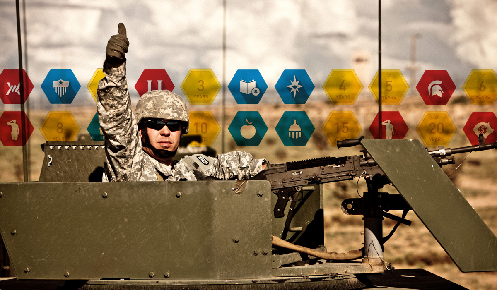

When I took over as product manager in January, I saw a big problem. The app was supposed to show how a career with the National Guard could lead to opportunities in the private sector. But there was no possible way to complete this product in time with the resources we had.

We had two devs, one designer and a content strategist. They were each at the top of their game. The deadline was two months away and we could not miss it. If they weren’t worried, why should I be?

In my first meeting with the team, our designer showed us her wireframes. They looked great. She had thought through all sorts of details that a user would want to know. The devs started thinking through the design, imagining any potential technical hurdles. And the content strategist brought a few great articles about life in the Guard. Everyone was doing what they were supposed to do.

But as I imagined the app in my head, I realized that there was no real-world data. Because the scope of the project was so broad, the team had only focused on one use case — essentially one career path — and built the app from there.

Even if we used career-focused APIs and matched them against MOS translation services, we’d have different categories of careers and a massive amount of job titles within each category. Each could have its own data structure, dirty data, or redundancy. Without knowing this and testing it, the UI wouldn’t stand a chance against the data. I imagined every field blinking “N/A” “N/A” “N/A.”

I was floored. We had no app.

#### Throw out the map

When projects start to fail, everyone hardens up. No one wants to be the reason it failed, so everyone just does what they’re told to do. It is exactly the time when people need to be liquid.

We needed hard reset to get us moving. I turned the timeline into a scrolling Choose Your Own Adventure. While this chopped the legs off a potentially really cool application, a CYOA is something we could accomplish. We started building immediately .

This new plan only looked a few feet ahead. The devs were to make a page that could dynamically load content based on the user’s binary choices and lead the user to the next section.

The designer shifted her focus from app design to game design. This was easier to imagine and more fun.

I worked with the content strategist and backend developer to map out an acyclic graph to the story we hoped to tell.

By shifting our minds to **building** instead of **planning**, by throwing out the map, I knew we’d see other potholes. By thinking fast instead of slow, we would enjoy serving around the potholes instead of stopping and questioning them. We were going to get this timeline to the finishline.

#### Think fast and fill in the gaps

Thank God for Google spreadsheets. We were moving so fast that we didn’t have time to fuss with a CMS. Instead, we made a Google spreadsheet to be the backend and plugged it into the front-end. All at once, and quite by accident, everyone on the team could see what data was missing. It was complete transparency — We could start to see what we didn’t know. That spreadsheet was both our database and our project management tool. We were truly agile.

None of this would have been possible in a waterfall approach.

When you’re building something you haven’t built before, the designers and developers need to work side by side. Designers have to strain to think like developers and developers have to think like UX designers. No one person should be expected to account for all the unexpected minutiae in an application and hand it off to another group of people and expect them to do the same thing. With projects like these, problems are solved with the players in the field, not with an elaborate playbook.

This is particularly true when designing for new devices.

#### The Mobile Timeline

iOS bugs made our original mobile design seem kludgy and tedious. In a waterfall environment, developers would have had to spend extra cycles working through bugs to stay true to the design. But because our designers and developers were able to work together, we were able to quickly learn and adapt.

So we found a new solution to the design that was incredibly easy to implement for the developers. We moved away from persistent fixed elements on the screen and opted for contextual navigation within the stream of content. It was more flexible, broke up monotonous blocks of text, and had the same level of affordance as the previous solution. The devs were then able to focus on QA — all before the deadline.

Even though we were rushed, we still built a modular architecture. Even the mockups had BEM tags. This let us blow through an MVP to prove the idea and easily enhance components without rewriting the whole thing,

It already looked pretty good but now we had time to make it look great. We designed in the browser so everyone could see how much a difference a little animation could make to the overall experience — one extra line of code. We even had enough time to expand a component to contain video backgrounds and — wowwy — did those look good.

We delivered the Timeline on time and our clients were happy.

#### Footnotes

1.  Mobile UI design is far more like Material Design. You can’t design a wooden table the same way you’d design an aluminum table — the same goes for mobile. On the desktop, it is easy to forget this. Real estate is cheap on the desktop. **Designing for mobile can feel like planning a wedding on a submarine.** Designers must spend time with developers to understand the mobile material. They have to able to test its limits and try out better solutions.
2.  “Product Vision” usually means an ability to define and inspire some Herculean goal. But there is a more subtle side of product vision that leans into limitations. If capital “PV” Product Vision is CrossFit, the other kind is racquetball.

Check out [My Career Timeline](http://www.nationalguard.com/my-career-timeline) to see the results.
