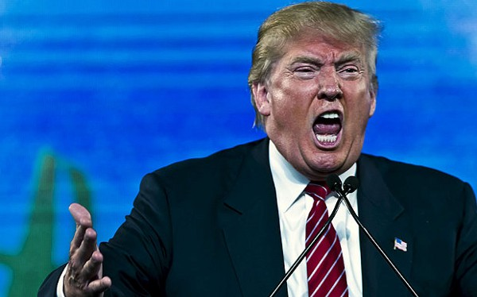

_This post was supposed to be a transcript, but it doesn’t fit anymore. I’ve got to add a few things. There’s another side to Dark Patterns, an_ **_Upside Down_** _world, if you will._ [_Here’s the original_](https://www.notion.so/Dark-Polls-Dark-Patterns-Black-Mirrors-43bca8c0ddff4afdbbda9c50dbd625b5) _if you’re curious._

_I gave a talk the night before Halloween about Dark Patterns. The talk opened with a nod to Trump’s “_**_Dark Polls_**_.” But then a few days later, Trump won. _

_This post was supposed to be a transcript, but it doesn’t fit anymore. I’ve got to add a few things. There’s another side to Dark Patterns, an_ **_Upside Down_** _world, if you will._ [_Here’s the original_](https://www.notion.so/Dark-Polls-Dark-Patterns-Black-Mirrors-43bca8c0ddff4afdbbda9c50dbd625b5) _if you’re curious._

### 1\. Dark Polls

“Dark Polls” isn’t the craziest thing Trump invented. It kind of makes sense. Statistical sampling errors could be the root of all evil. In 50 years, polls could be akin to bloodletting. 

“Dark Polls” sound cool. It sounds like **Dark Pools**, stock market black boxes that shift money around in the shadows.

And Dark Polls has a whiff of Bush-Gore 2000, an election so close that **punch card ballot design** came into question. Trump never specified what a Dark Poll was exactly, just that it was wrong.

Wikipedia is silent on the subject of Dark Polls, because its not really a thing, but “Dark Polls” has a great ring. It reminds me of the 80s-sci-fi-homage **Stranger Things**. 

---

Now that I think about it, **Trump is an 80s-horror-homage**. He’s low-budget, tacky and harmless. But I digress. (edit: FML)

### 2\. Dark Patterns

We see 100s if not 1000s of dark patterns every day. Dark Patterns are so pervasive, they are almost indistinguishable from advertising.

> A [dark pattern](http://www.theverge.com/2013/8/29/4640308/dark-patterns-inside-the-interfaces-designed-to-trick-you) is a user interface carefully crafted to trick users into doing things they might not otherwise do, such as buying insurance with their purchase or signing up for recurring bills. Normally when you think of “bad design,” you think of the creator as being sloppy or lazy — but without ill intent.

That last example is something that happened to me while I was filling out my taxes. Tennessee doesn’t have a state tax but TurboTax still prompted some Tennesseans to pay for a tax return. I nearly fell for it and I spoke to a few others that had.

  

[**Dark Patterns - User Interfaces Designed to Trick People**  
_Normally when you think of "bad design", you think of the creator as being sloppy or lazy but with no ill intent. This…_darkpatterns.org](http://darkpatterns.org/ "http://darkpatterns.org/")

[**Dark Patterns: inside the interfaces designed to trick you**  
_These carefully crafted elements are built to misdirect and confuse Harry Brignull is a London, UK-based independent…_www.theverge.com](http://www.theverge.com/2013/8/29/4640308/dark-patterns-inside-the-interfaces-designed-to-trick-you "http://www.theverge.com/2013/8/29/4640308/dark-patterns-inside-the-interfaces-designed-to-trick-you")

[**Dark Patterns are designed to trick you (and they're all over the Web)**  
_It happens to the best of us. After looking closely at a bank statement or cable bill, suddenly a small, unrecognizable…_arstechnica.com](http://arstechnica.com/security/2016/07/dark-patterns-are-designed-to-trick-you-and-theyre-all-over-the-web/ "http://arstechnica.com/security/2016/07/dark-patterns-are-designed-to-trick-you-and-theyre-all-over-the-web/")

### 3\. Dark Patterns and Politics

Harry Brignull probably wouldn’t call the Bush-Gore ballots a dark pattern. They might be examples of shady, fuzzy or patterns but he was careful not to be too liberal with labels. **Hanlon’s Razor** comes up often when dissecting dark patterns.

> Never attribute to malice what can adequately be explained by stupidity — Hanlon’s Razor

Strict definitions around dark patterns helped make a handful of them illegal in the UK.

  

#### Dark Jeopardy: 

_Which of these is a Dark Pattern?_

We encounter 100s of dark patterns every day, especially if you don’t stick to the strict definition of the phrase. 

  

---

### 3\. Black Mirrors

now we’re at the meat of it.
