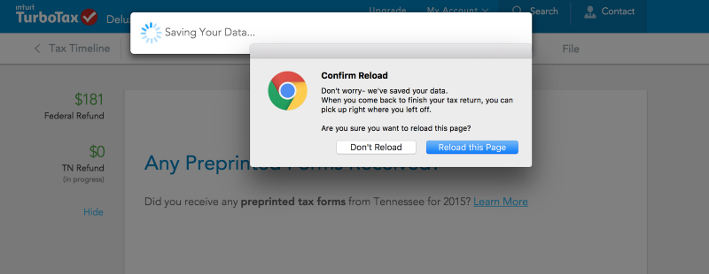
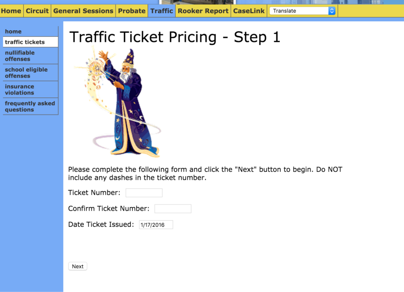
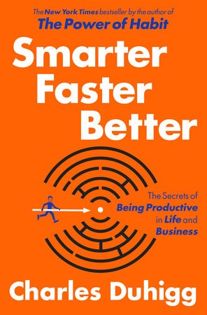

Tax Day was on Monday, so that’s of course when I did them. Fortunately, TurboTax saves my day. Their UX is so good it’s eerie, and it gets better every year.

“Welcome Home,” says TurboTax when I login. “How are you feeling about your taxes this year?” I click the “okay” emoji with the flat mouth. TurboTax understands and gently reminds me about last year returns. “We’ve done this before, we can do this again,” it tells me.

At one point my wifi choked and I saw the terrifying pinwheel. TurboTax was there, thoughtful and predictive as always.

Contrast this with trying to pay a parking ticket online in Nashville, TN. Here is a parking ticket wizard:

The wizard never found my ticket number and offered no wise counsel. I had to pay in person.

---

Back to TurboTax: I just got through my Federal Taxes and I knew I was getting close. Tennessee doesn’t have state taxes! But then TurboTax got a little strange.

It just told me that I have $0 state taxes, but do I still need to file something for that? I cautiously declined the offer to file both my taxes together. But then they ask me again, are you absolutely sure you don’t want to file your state taxes?

That’s correct, TurboTax, that is Tennessee — the state, along with 12 other states, that doesn’t have a state tax. I decline the offer again but my confidence is shot. This time, I’m allowed to pass.

Dark Patterns are fascinating, sort of like scalable social engineering, and there are [examples](http://www.theverge.com/2013/8/29/4640308/dark-patterns-inside-the-interfaces-designed-to-trick-you) [all over](http://alistapart.com/article/dark-patterns-deception-vs.-honesty-in-ui-design) [the web](https://www.usertesting.com/blog/2015/10/01/dark-patterns-the-sinister-side-of-ux/).

> [A Dark Pattern is a user interface that has been carefully crafted to trick users into doing things, such as buying insurance with their purchase or signing up for recurring bills.](http://darkpatterns.org/)

I love TurboTax’s carefully choreographed UX, so I don’t want to think that this an intentional dark pattern. It’s probably an edge case they haven’t gotten to yet. After a few more clicks, I fell for another upsell. I can pay TurboTax with my refund, they say. “Don’t even pull out your wallet!” But they don’t mention that’ll cost an extra $30. Fortunately, I caught it in time.

### Cognitive Tunneling and Automation

The experience was similar to something I just read in [Smarter Faster Better](http://amzn.to/1XQWdS5) called Cognitive Tunneling — a mental hiccup that was probably responsible for the disastrous [Qantas Airways flight 32](http://lifehacker.com/the-power-of-mental-models-how-flight-32-avoided-disas-1765022753).

> There is significant evidence, however, that Bonin was in the grip of what’s known as “**cognitive tunneling**” — a mental glitch that sometimes occurs when our brains are forced to transition abruptly from relaxed automation to panicked attention. ( location: 1214 in Smarter, Faster, Better)

And while taxes are not as stressful as flying a plane, I was certainly on autopilot. I was racing to the finish line, trusting TurboTax’s beautiful money-saving automation engine.

> Automation has today penetrated nearly every aspect of our lives. Most of us now drive cars equipped with computers that automatically engage the brakes and reduce transmission power when we hit a patch of rain or ice, often so subtly we never notice the vehicle has anticipated our tendency to overcorrect.( location: 1196 in Smarter, Faster, Better)

---

### Conway’s Law, the Interface, and the Infrastructure

I’m not out to vilify TurboTax, they deserve to make a buck like anyone. **What interests me is that TurboTax is practically the interface for the IRS.** There’s me on one side, TurboTax in the middle, and then on the other side, a bunch of people who can throw me in jail.

> Conway’s Law says this: Companies create products and services that are a reflection of themselves, the way they’re organized, communicate and work. Most often products and services get structured to mirror the way the companies producing them are structured. (from [firstround.com](http://firstround.com/review/the-keys-to-scaling-yourself-as-a-technology-leader/))

Startups are interested in growth and scale. They achieve growth and scale by automating and optimizing. They do this relentlessly. Startups to not have the luxury of catering to edge cases.

The IRS, like many other government services, is all about edge cases. It is a highly-bifurcated and ever-shifting infrastructure that is immune to disruption.

So we’ve got two products, one is the **infrastructure** and the other is the **interface**. They both come from two completely different monocultures that, aside from being echo chambers, have nothing in common. They’re even on opposite sides of the country.

### Tragic Design and Inadvertent Algorithmic Cruelty

Interfaces that come massive infrastructure-driven agencies are often terrible and even tragic. Jonathan Shariat, who is writing a book called Tragic Design, wrote about a case where a young girl died due to cognitive tunneling and pseudo-dark patterns.

> [However, after the medicine was administered, three nurses were attending to the charting software to enter in everything required of them and make the appropriate orders, missed a very critical piece of information. Jenny was supposed to be given 3 days of I.V. hydration. But the three nurses, with over 10 years experience, were too distracted trying to figure out the software they were using, they completely missed it.](https://medium.com/tragic-design/how-bad-ux-killed-jenny-ef915419879e#.qj1pwvbzo)

He concludes the story with this plea:

> Being a designer who is very passionate about what I do, this hurt. In all honesty, I don’t think I’ve ever felt this emotional about any bad design I’ve encountered. I feel angry and sick when I look at that interface above. I start to think about the other stories that have been shared: like an [ebola patient being sent home accidentally](http://www.theatlantic.com/technology/archive/2014/10/the-ebola-patient-was-sent-home-because-of-an-electronic-health-record-problem/381087/), [a pilot accidentally plotting the wrong course](http://blog.martindoms.com/2011/01/24/poor-ui-design-can-kill/)killing crew and passengers, and so many other stories like them. I even think about my poor in-laws who are 60+ trying to navigate the government sites to pay for their ticket, or find information about government services for their son.

> We can’t stand by while people’s lives, health, & rights suffer because of bad design.

After reading that story, it seems like anything would be better than those interfaces. But even in Silicon Valley, Conway’s Law creeps into the interface and hurts people.

Eric Meyers tells a [chilling true story](http://meyerweb.com/eric/thoughts/2014/12/24/inadvertent-algorithmic-cruelty/) where Facebook, trying to push a new feature, made him a victim of inadvertent algorithmic cruelty. He concludes:

> It may not be possible to reliably pre-detect whether a person wants to see their year in review, but it’s not at all hard to ask politely — empathetically — if it’s something they want. That’s an easily-solvable problem. Had the app been designed with worst-case scenarios in mind, it probably would have been.

> If I could fix one thing about our industry, just one thing, it would be that: to increase awareness of and consideration for the failure modes, the edge cases, the worst-case scenarios. [And so I will try](http://meyerweb.com/eric/thoughts/2014/11/06/a-new-chapter/ "A New Chapter").

And it even plagued Google on [April Fool’s Day](http://boingboing.net/2016/04/01/google-launches-worst-corporat.html).

But we are moving into an era of even greater automation, of artificial intelligences that don’t have an eye for edge cases, run by companies that don’t have the time for edge cases. And they are becoming the middle layer between us and government agencies, they are becoming _our_ representatives.

### The [User Politic](https://en.wikipedia.org/wiki/Body_politic)

Good, honest UX will help. A passionate UX designer is a lot like what you want in a politician. They put aside their own interests for the needs of the constituency. However, a UX designer is not empowered the way a politician is. They are ultimately working for a company with its own ambitions and mental models. For most companies, User Experience is way to get the user to buy something, not defend the user’s rights.

In light of these massive shifts between tech and government, what if UX sheared away from startups and became a form of human rights activism, a sort of UserX?

We, the people, should have a say in the UI of critical services. From Facebook down to Healthcare and all the way to Washington, I want to hear you yell: **_No Interaction without Representation!_**

---

If you’d like to hear other musings or just find out what I’ve been reading, please sign up for my newsletter at [sudoscience.io](http://sudoscience.io).
