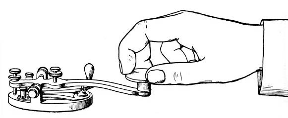

Andrew Ng spoke recently about the State of Artificial Intelligence where he compared companies in the Internet era to emerging AI companies. (It’s a great talk and everyone watch should it.)

> If you take a shopping mall and you build a website for it, this does not equal an internet company. — Andrew Ng

True internet companies adopted a bottom-up infrastructure that played to the strengths of the web. The internet made continuous feedback and iterative development a necessity. That’s why we have UX designers and product managers. 

So what will be the traits of true AI companies? Ng listed a few:

-   Data as the defensible barrier to competition 
-   Centralized data warehouses 
-   Advanced data acquisition strategies (more on that later) 
-   New job titles (this one really stuck out to me)

> If you draw a wireframe of a self-driving car and hand it off to an engineer, this will not be useful. — Andrew Ng

I’m a product manager for a cross-disciplinary AI team in the enterprise, and Andrew Ng is 100% correct. Our job titles, assumptions, and methods are already breaking down.

**What does a balanced team look like in the AI era? Is there a place for Product and UX?**

, giving me night tremors.](./asset-1.gif)

### _First, the bad news_

#### Data Science ≈ UX

The data scientists I’ve worked with are very product-oriented. They scour the problem space, looking for suspicious data. They interrogate the data and usually torture the data.

#### Model ≠ Prototype

Data scientist spend most of their time on data discovery and feature engineering, not making models. So prototyping doesn’t quite fit into an ML workflow. Trial and error replaces prototyping.

The _product_ of machine learning is the _model_. In the enterprise, the model can optimize or automate systems, detect patterns, increase transparency, reduce cost, etc — all without being tied to an application. 

Standard metrics like adoption and usage have to be reconsidered when the core product doesn’t have an interface.

#### Data Points ≠ Touch Points

“Don’t Make Me Think,” that old UX chestnut, applies even more to the AI era. If the model can predict the user’s intent, 

-   touch points decrease
-   cognitive load shrinks
-   interactions feels more natural. 

It’s stunning how fast consumers have taken to AI interfaces. That, in turn, gives today’s design patterns a much heavier cognitive load. Clicking “Submit” feels as natural as sending a telegram to a person next to you.

### But there is hope (the good news)

  

  

  

  

notes (don’t read past here)

A successful ML model reduces the need for complex user flows by predicting the user’s intent. 

When the cognitive load of an interaction shrinks, the exchange feels more natural.

However, there is hope.

---

1.  The data is never there. (macgyver)
2.  Circular Error Probable (seatbelt)
3.  Is there a there there? (framing and scope, sanity check)
4.  narrowing the gateway (voice transcription, interstitial feedback loops)
5.  hybrid solutions
6.  environment design (sensors)
7.  orthogonal quick thinking (crazy ideas from not being an expert)
8.  system design (instead of architecting a better bandaid)
9.  ethics (don’t have a dog in this fight. I’m not as concerned about gender bias from lab models as I am an overwheening pride about the bell curve itself)
10.  evangelism (understanding the enough to explain it to others)

I think this is why I was the first hire on the team. 

Previously, I had only worked on NLP projects using various cognitive services to make apps (for Alexa or Google Home). This type of ML was much deeper, much more critical to the company’s core domain. And I felt completely out of my depth. 

But I was part of a larger group that had made strides in changing the culture of the company. Actually rearchitecting the company to fit with current technology. We did this through communication, empathy, enthusiasm and spirit of personal ownership. (That’s how Home Depot embraced UX). 

Andrew is right about companies needing to rearchitect their infrastructure around the strengths of AI. It’s not just a tech transformation. It goes much deeper.

Which brings us back to the title of this think piece. How do you wireframe a self-driving car?

until next time…

  

Notes:

need tools for this. xstate is promising. so it polaris. but I want something more. the four layer framework.

also look at Descript, which is much closer to augmented intelligence. it is transactional, not simply input/output. These sorts of products are the most exciting to me. They are hybrid to the core.

  

Ethan, an engineer on my team, 

New designs can actually be problematic if they threaten the training data. 

it can decouple actionable results from bespoke interfaces.
