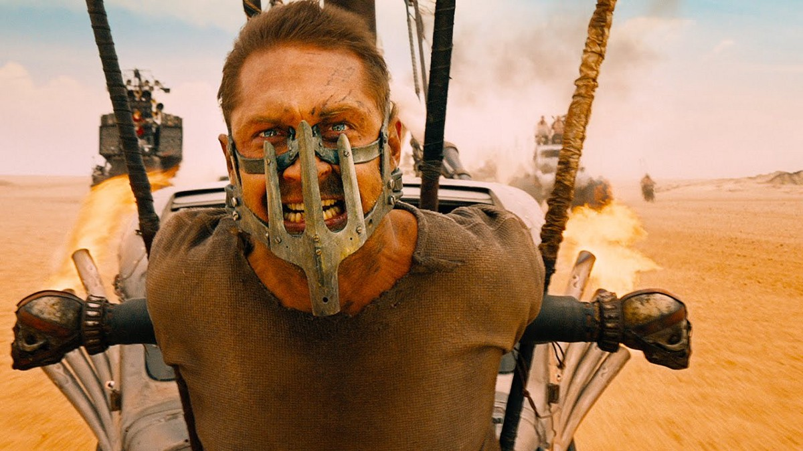

Guys, what an incredible finale! Despite the scandal of the movie’s feminist overtones, I just want to make one point — the film was true to form.

The transition from the rollicking 20th century to the inevitable apocalyptic landscape of the near future — ignited by America’s capitalism and greed — was completely unexpected but thematically on point. How else can you finish a show that spans decades? You go big, that’s how!

To see Don Draper strapped to the front of a diesel engine, atoning for his former sins, was truly cathartic. His life blood getting sucked from him like a cigarette to power the machine he created — perfect. However, he eventually patches things up with the ladies and leaves them wanting more — therefore true to form.

Bravo, team!
