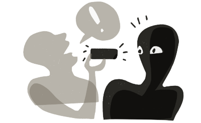
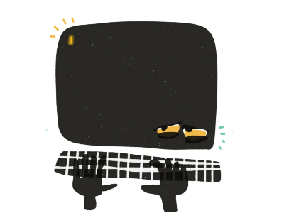
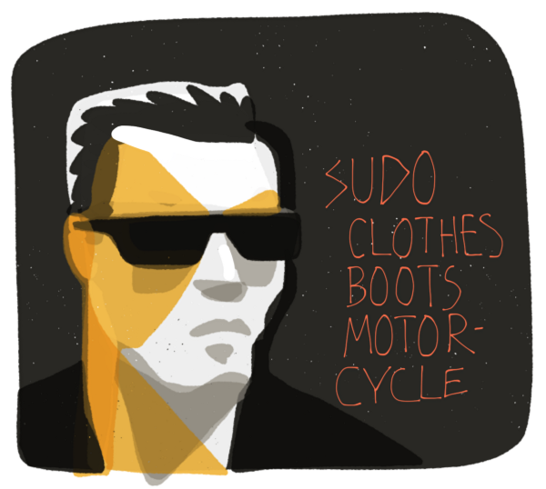
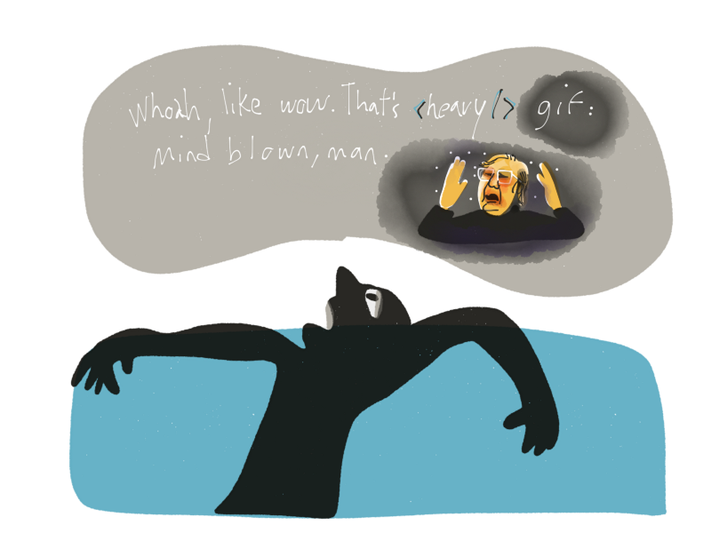

  

Photo by [Matthew Wiebe](https://unsplash.com/matthewwiebe)

When the blind man said “**_exclamation point_**,” I had an epiphany. This was many years ago, so it’s quaint on recollection, but I watched the man sitting next to me on the train hold his phone like a remote control and speak to it, interspersing commas and exclamation points in between descriptions without hesitation. To me it seemed he had invented his own shorthand — his own **_command-line_**.

#### The Command Line

Back then, I spent most of my time talking to a different kind of black rectangle. Not a smartphone, the command-line. [The command-line](http://en.wikipedia.org/wiki/Command-line_interface) (or CLI) feels like the end of the line. That’s probably why it’s also called The Terminal — it’s like finding yourself in the **shadiest dive bar in the world**  and every drink you ask for is actually something offensive about the bartender’s mother.

But the command-line is extremely powerful. It lets you install packages so you can customize the interface any way you want. This interface has no buttons or fancy animations — it’s more like **a private language** filled with words that think for you.

> If you can get good at the language, you can become a **machine**.

For example, I installed a package in the command line called **Markdown**. All I have to do is preface a word with a hashtag and that word magically transforms into something the DOM recognizes as a headline. So “#I’ll be back” becomes…

_wait for it…_

## **<h1>I’ll Be Back</h1>**

Pretty cool right? I thought this man on the train had simply installed a punctuation package and now “**exclamation point**” became “**!!**” Of course, the iPhone does this for us out of the box and we are all _incredibly grateful_ for that, but what if you could install your own private language?

Imagine an autocorrect that didn’t overcorrect your “f\*ck” to “duck” because you installed a swearing package. Imagine “sql” not rebooting itself as “awl” because you installed the “I’m a developer, dammit” package.

So my epiphany — could smartphones become the next CLI? What would that do to our language if we could program and talk at the same time? What would that do to our thoughts if we interspersed dialogue with precompiled commands? LOL #whut?

> What would the world sound like if HTML became our language?

#### Further Examination

In other words, will speech ever become a machine language? What are the advantages of leaving GUIs behind and returning to CLIs? What are _thinking words?_ In the next few posts, I’m going to explore these ideas.
