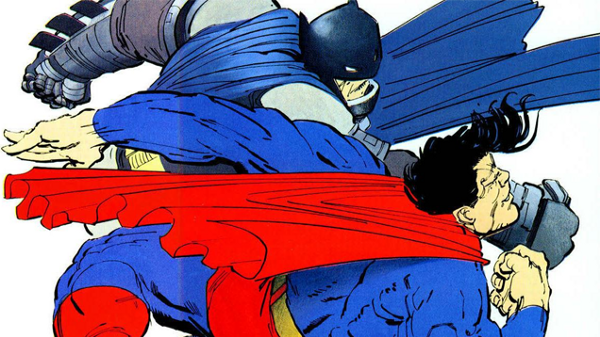
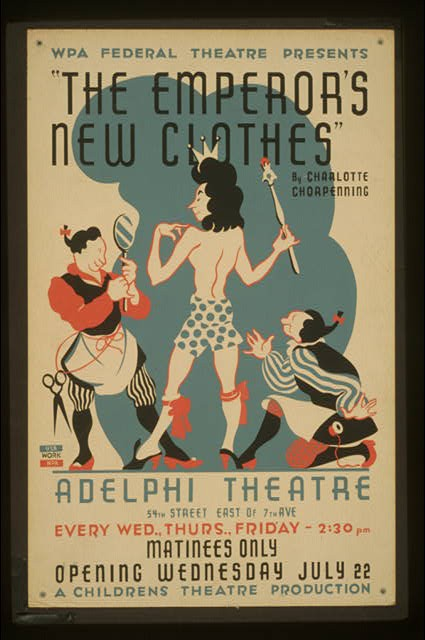

It's easy to be distracted by the stories that the Internet has gone native and the web is dead. 

In many ways this is good for the web, we need a challenge. We were stagnant for so long. Today’s web communities are rallying together to save the web. 

TK Conferences like Restfest dig into the mysteries of the Semantic Web. Famo.us is working on a powerful graphics engine. Google developers are building network-level APIs that promise native-like performance. React, from Facebook, is leading a revival to place javascript at the center of web development, similar to Objective-C or Java. 

We’re like Batman getting all mecha’d up to take on Superman in hand to hand combat! But wait, wouldn’t Batman be smarter than that? Do you get the suspicion that the writers know that too? 

Are we using _superhero logic_ when what really going on is a _perception problem?_

Let’s take another look a few predictions and see if there may be another story.

-   Every new app is trying to be the next browser.
-   Since the iphone, podcasts have exploded in popularity.
-   Apple and Facebook are blocking ads to provide news more quickly.
-   Services like Squarespace and thegrid.io aim to commoditize and simplify web sites.
-   While services like Medium, Instapaper and Flipbook aim to simplify the reading experience.

There’s alot more going on here than web vs native. I see three main themes here, and I may have to create separate posts for each.

1.  The model (content, content, supply) is detaching from the view (context, style, demand). 
2.  Products and platforms are solving a problem of configuration over convention. this help content creation and distribution.
3.  New media that is tightly-bundled (compiled) is less fatiguing than the lingua franca of the web. 

I believe these issue all stem from the same ontological ancestor: Product vs Protocol.

What has not happened, what seldom happens, is what the web was meant to be: a medium for collaboration.

  

  

  

  

  

  

with all the prognostications about the web’s fate. 

  

  

We’ve all heard the refrain is that the Internet has gone Native. 

  

  

