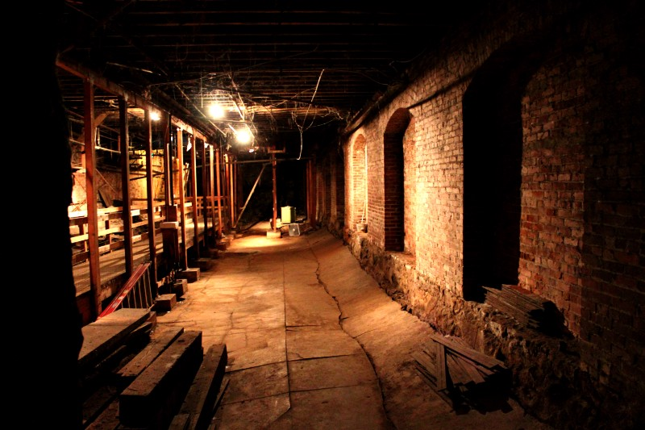
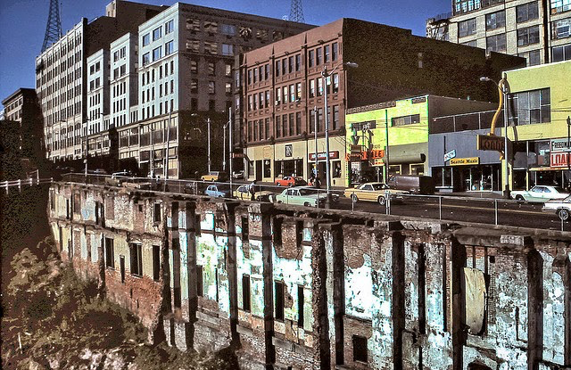
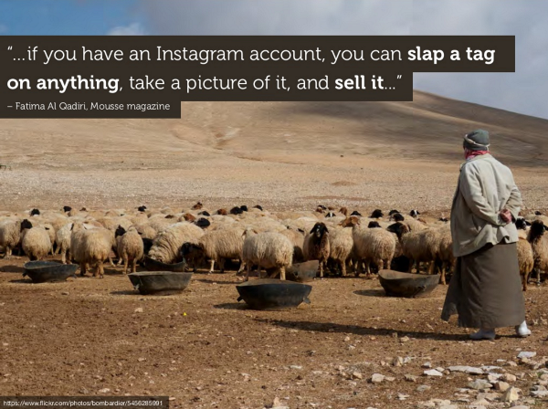

_A metaphor for the modern web_

> After the Seattle fire in 1889 that wiped out nearly thirty blocks, the city planners had a beautiful idea —raise the city.

In the 19th century, much of Seattle was at sea-level. It was a putrid pioneer town. If you tried to use a toilet during high tide, you’d get what people in the UX community call a Dark Pattern.

Fortunately, the town was flush with cash and everyone was keen on lifting the city above sea-level. Then they heard how long it was going to take.

10 years!? When the store owners heard the news, they started rebuilding their stores the next day, on the ground floor. They couldn’t wait 10 years, the Gold Rush would be long over by then.

But the city went ahead and build the roads their way — 35 feet above the marketplace.

Imagine that you’ve tied up your horse next to a ladder. You take your bags and cash and start to climb down the 35-feet to the shadowy marketplace below.

Now if you’re a store owner, it wouldn’t matter how beautiful your store front is or how impeccable the service you provide — the customer is going to remember one thing: how to climb back up that ladder without getting murdered. That’s bad UX.

> The web is in similar straits. The platform has moved above the marketplace.

[The Web Is Dead. Long Live the Internet.](http://www.wired.com/2010/08/ff_webrip/) [No really, web design is dead](http://uxmag.com/articles/why-web-design-is-dead). [Mobile is eating the world](https://vimeo.com/130722577) and [it can’t compete with other meta-platforms](https://medium.com/@paul_kinlan/rise-of-the-meta-platforms-and-the-new-web-browser-a93dcdd9dad#.k8oarzgh3) or [their business model](http://www.theverge.com/2015/9/17/9338963/welcome-to-hell-apple-vs-google-vs-facebook-and-the-slow-death-of-the-web), [so we should stop trying](http://www.quirksmode.org/blog/archives/2015/07/stop_pushing_th.html).

Remember Responsive Web Design? That seems like a **“Seattle Ladder™”** these days rather than a real alternative to native. And while Google is making great strides with Service Workers and Web Intents ([pun intented](https://medium.com/google-developers/deep-web-app-linking-41667fe69c80#.v5k47dxv0)), there are still so many [technical hurdles](https://paul.kinlan.me/be-instant-and-engaging-on-the-mobile-web/) to overcome. By that time, where will native platforms be?

Some trusted pundits are suggesting that the web take a break:

> I don’t think this is a particularly good place to push the web forward to. Native apps will [always be much better at](http://www.quirksmode.org/blog/archives/2015/05/web_vs_native_l.html) native than a browser. Instead, we should focus on the web’s strengths: simplicity, URLs and reach.

> The innovation machine is running at full speed in the wrong direction. We need a break. We need an opportunity to learn to the features we already have responsibly — without tools! Also, we need the time for a fundamental conversation about where we want to push the web forward to. A year-long moratorium on new features would buy us that time. —[ Peter-Paul Koch](http://www.quirksmode.org/blog/archives/2015/07/stop_pushing_th.html)

While I agree with him in spirit, that’s like asking Seattle store owners to wait until the Gold Rush is over.

Meanwhile in Seattle, things got worse. If an overburdened buggy took a turn too quickly, the cargo could topple into the abyss and kill passers-by. Town drunks couldn’t climb back up the ladder to go home. They would also die. When a case of plague took over the underground, city planners paved over the moat between the road and stores.

A few store owners were smart. They turned their second-story windows into their front doors and closed off access from the ground floor. But that may not be as easy an answer for the web.

### The Internet Rainforest

In their podcast [Exponent](http://exponent.fm/episode-012-the-internet-rainforest/), Ben Thompson and James Allworth extended the raised platform metaphor to a rainforest. Companies like Amazon, Apple and Facebook create a leaf canopy that block out all life but the smallest vegetation on the ground floor. There is no ladder to get to the top.

However, it has built business models that feed off the platform itself.

 — all of their presentations are incredible.](./asset-4.png)

Is this the fate of the web as well?

Peter-Paul Koch is right, we need to drastically refocus our understanding of the web — but we don’t have time to stop.

In the next post I’m going dive into this problem by looking at the history of the web. I hope this can start a conversation about how the web can fit in an internet of things.
