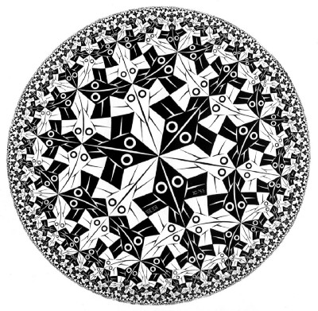

The word _hyperbolic_ is mainly used to describe rhetoric that leans to the extremes. If everything is **super great**, you are probably in the presence if hyperbolic speech. But the word itself has a few other dimensions than just ‘_extremely good_’ or ‘_extremely bad_.’  
  
MC Escher drew hyperbolic patterns. They looked like crystal balls, with the patterns warping at toward the rim until they became infinitely small. But MC Escher drew his inspiration from math, not speech. And mathematically, the birds and fish are not getting smaller, just further away. Like boats on a horizon. 

So \*hyperbolic\* has always been an interesting word for me because it seems to contain two completely opposite beliefs.(Kids, this happens often in math and is also why math is so great.)  
One belief (a) would say that the center has the most detail and precision, while the edges are broad, extreme and generally not well thought out.  
The other belief (b) would say that the extremes actually contain exponentially more detail than the rather obvious center.   
To put it another way, when we read books about quantum theory we are hovering around the center. A scientist at CERN is probably deep into a hyperbolic crevice, so much so that we can’t know just how more she knows than we do. This is how it is with all experts.  
To another scientist, her expertise may not seem so unique. He’s the expert and she’s in the middle somewhere, as evidenced by how hyperbolically she talks about things she doesn’t really understand.  
My description of hyperbole will appear to some english majors as grossly inaccurate. As they map me in their minds, to some I’ll be in a corner (a) and to others I’ll be in the center (b).
