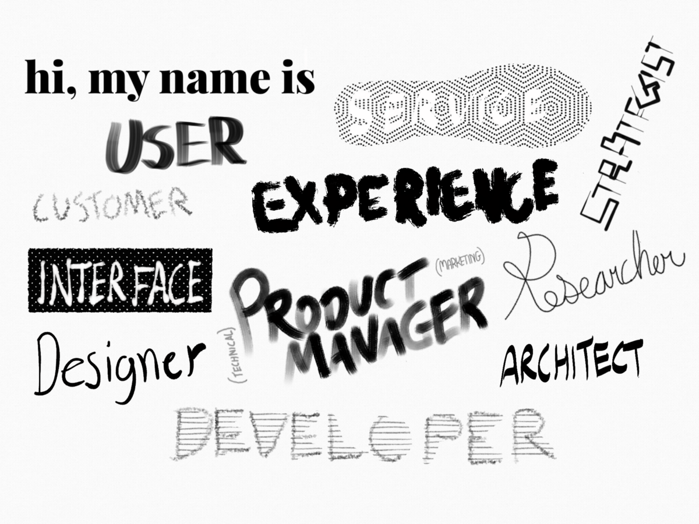

We can’t be the only industry with a naming problem. 

Take the music industry for example. When a studio musician applies for a job, “bass guitarist” doesn’t come close to describing what he does. It fails to describe that sound he spent years refining, a sound that one critic called “the sound Modest Mouse makes after wakes up next to Cherry Poppin’ Daddies.” This musician may have evolved over the years, but there will still be vestigial licks that’ll betray him. 

I didn’t go “into the arts” for that reason. By the time you’ve got that Nickelback sound just right, the nation has collectively moved on to Kid Rock. In science, these are called paradigm shifts. 

There is no name for the taste-phase shift that occurs in pop culture (as far as I know), but there should be. In the same way that people who are dropped into a \[google earth game\] seem to pick up on the sparse clues and figure out where they are. (as if they’re reading laylines) We can sense the influences in the arts (everything is a remix).

but that fails to describe the phase shift that occurs. But its the reason we can hear a song we’ve never heard before and pick out what year it came out with a stunning degree of accuracy.

---

As tech has grown more popular, its sad to see that it hasn’t grown up. If anything, it seems to be borrowing from pop culture. These days you have to worry about the subtle suggestions in your job title the way a band would pick their name. (or genre). there is no science behind it, it is simply a accretion of metaphors and associations.

  

Our industry is built on code. Maybe we just like coded language and take pleasure in sprinkling our resumes 

  

That must be why we persist with the coded language of our job titles. It is particularly bad whenever design gets involved. 

---

\[Principal, Senior, Lead, Technical, Chief, Director of, VP of, \]

User, Customer, Product, Project, Content, Business, System, Service, Solutions

Experience, Interface, Marketing, Technical, Design

Director, Manager, Designer, Developer, Architect, Strategist, Researcher, Analyst,

---

Future titles: Captain, Ombudsman, Navigator, Investigator, Overseer, Storyteller, Prospector, Stevedore, Concierge, Actuary

  

-   I identify as a product manager and UX strategist.
-   I wear a cape of lifelong learning. It grows as I learn and shrinks as I forget.
-   This mask is my product vision. It is made to look like my face. 
-   My body armor boasts my grasp of architecture and mobile design.
-   Under my armor are two tattoos: One says ‘I build velocity’ and the other says ‘Be the change you want to see.’
-   My lightcycle is made of wireframes.
-   My fists are made of javascript. (I try to avoid violence.)
-   My young sidekick is lean and open source.
-   My dead father is Tim Berners Fucking Lee.

---

-   If I had to define my sound, I’d say its Electro-prog-clojure-rock.
-   Performance is everything and on stage, I’m all startup. At home, I write enterprise-level ballads. 
-   I can play most instruments, but I’m best at synthesizing the strengths of the team to make a cohesive product. So yeah, the synthesizer.
-   Practice makes data. Data makes iteration. Iteration makes fractals. Fractals sound good. (Inspirations: Bach, Rich Hickey, Georgio Moroder)
-   I toured with Representational State Transfer for a while but the songs were too monolithic.
-   Currently exploring Hardcore-Gaelic-Machine-Learning.

---

-   Leading man (young Richard Dreyfuss/Steve Gutenburg type) in romantic comedy.
-   Fakes his way into medical school (self-taught) with wry wit and daring do. Unflappable, affable and disarmingly intuitive. 
-   Falls madly in love with the dean’s daughter, aka, your product. 
-   Works night and day to make the relationship work. Gets his team of misfit developers and designers to win championship, thus achieving product/market fit. 
-   Ultimately wins your approval.
